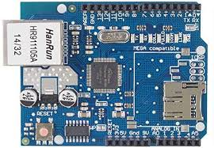

# PLACAS DE DESENVOLVIMENTO

### Arduino UNO

É uma placa baseada no microcontrolador Tmega328 \([datasheet](http://www.atmel.com/Images/doc8161.pdf)\). Ele tem 14 pinos de entrada/saída digital \(dos quais 6 podem ser usados como saídas PWM\), 6 entradas analógicas, um cristal oscilador de 16MHz, uma conexão USB, uma entrada de alimentação uma conexão ICSP e um botão de reset. Ele contém todos os componentes necessários para suportar o microcontrolador, simplesmente conecte a um computador pela porta USB ou alimentar com uma fonte ou com uma bateria e tudo pronto para começar.

### SHIELD ETHERNET 

Consiste em um shield dotado de dois módulos, um **módulo** **Ethernet**  baseado no chip ethernet **Wiznet W5100,** que irá permitir a conexão do **Arduino** com uma rede local e a internet, e um **módulo para cartão micro SD**. Sendo assim, perceba que é perfeitamente possível utilizar este módulo somente para ler/escrever dados em um cartão de memória ou apenas para conectar o **Arduino UNO** a uma rede local.

### ESP32

ESP32 é uma série de microcontroladores de baixo custo e baixo consumo de energia. tambem é um sistema-em-um-chip com microcontrolador integrado, Wi-Fi e Bluetooth. Com isso é possível desenvolver a partir dele uma gama maior de variedade de projetos IoT. O WiFi suporta uma taxa de 150Mbps e potencia de 20,5 dBm na antena, permitindo e conexão direta à internet. O Bluetooth BLE permite que qualquer celular se conecte a ele enviando diversos tipos de informação com baixo consumo de energia.

### ESP8266

O ESP8266 é um microcontrolador do fabricante chinês Espressif que inclui capacidade de comunicação por Wi-Fi. O chip chegou a cultura maker em agosto de 2014, com a ESP-01. Esta pequena placa permite que microcontroladores se conectem a uma rede sem fio fazendo conexões TCP/IP usando um conjunto de comandos Hayes

### RASPBERRY PI 

É um computador de baixo custo e que tem o tamanho de um cartão de crédito desenvolvido no Reino Unido pela Fundação **Raspberry Pi**. Para usá-lo, basta plugar um teclado e um mouse padrão a ele e conectar tudo isso a um monitor ou a uma televisão.

